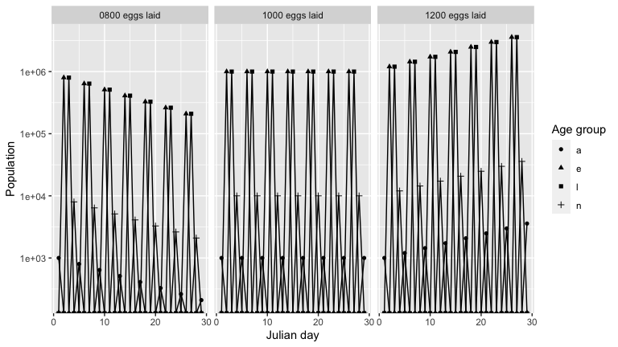

<!-- README.md is generated from README.Rmd. Please edit that file -->

# IxPopDyMod: A framework for Ixodidae Population Dynamics Models

This package is designed to help the user specify, run, and then
visualize and analyze the results of Ixodidae (hard-bodied ticks)
population dynamics models. Such population dynamics models exist in the
literature, but the source code to run them is not always available. We
wanted to provide an easy way for these models to be written and shared.

TODO see paper for a full description of the model

## Installation

Install the package from the [GitHub](https://github.com/) with:

``` r
# install.packages("remotes")
remotes::install_github("dallenmidd/IxPopDyMod")
```

## Example analysis

We present an example analysis using a simple model configuration
pre-loaded into the package. In this example, we will:

1.  Vary a parameter in the model
2.  Run the model with each new parameter value
3.  Calculate the growth rate for each of the model outputs
4.  Graph the population over time for each out of the outputs

<!-- end list -->

``` r
library(IxPopDyMod)
library(ggplot2)
library(dplyr, warn.conflicts = FALSE)
```

### Vary a parameter in the model

We give a new range of parameter values for number of eggs laid.

``` r
eggs_laid = c(800, 1000, 1200)
modified_configs <- vary_param(config_ex_1, from = '__a', to = '__e', 
                               param_name = 'a', values = eggs_laid)
```

### Run the model with each new parameter value

``` r
outputs <- run_all_configs(modified_configs)
outputs[[1]]
#> # A tibble: 116 × 6
#>      day stage    pop age_group process infected
#>    <int> <chr>  <dbl> <chr>     <chr>   <lgl>   
#>  1     1 __e        0 e         _       FALSE   
#>  2     1 __l        0 l         _       FALSE   
#>  3     1 __n        0 n         _       FALSE   
#>  4     1 __a     1000 a         _       FALSE   
#>  5     2 __e   800000 e         _       FALSE   
#>  6     2 __l        0 l         _       FALSE   
#>  7     2 __n        0 n         _       FALSE   
#>  8     2 __a        0 a         _       FALSE   
#>  9     3 __e        0 e         _       FALSE   
#> 10     3 __l   800000 l         _       FALSE   
#> # … with 106 more rows
```

The model output is a data frame with columns… Since we ran the model
with multiple configurations, we get a list of data frames.

### Calculate growth rate for each of the model outputs

``` r
sapply(outputs, growth_rate) 
#> [1] 0.9457416 1.0000000 1.0466351
```

The population is stable with 1000 eggs laid, as indicated by the growth
rate `1`. The population decreases with 800 eggs laid, and increases
with 1200 eggs laid.

### Graph outputs

To see a breakdown of how the population is changing, we graph the
population over time of each age group, for each model output. As
expected, there is a cycle with a peak in number of eggs, followed by
peaks in larvae, nymph and then adult
population.

``` r
names(outputs) <- c('0800 eggs laid', '1000 eggs laid', '1200 eggs laid')
outputs_stacked <- dplyr::bind_rows(outputs, .id = "id")
outputs_stacked %>%
  graph_population_each_group() +
  facet_wrap(~ id)
```


