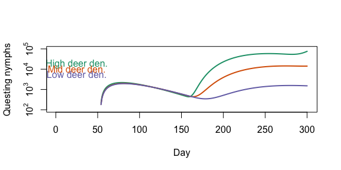
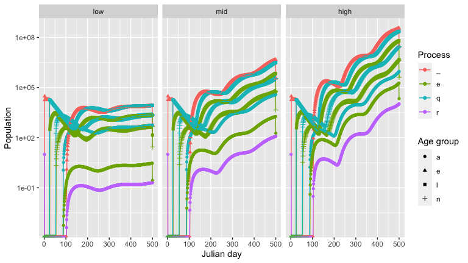
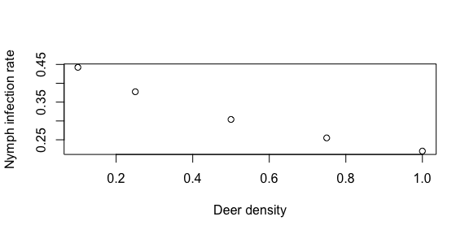

<!-- README.md is generated from README.Rmd. Please edit that file -->
<!-- badges: start -->

[](https://github.com/dallenmidd/IxPopDyMod/actions/workflows/R-CMD-check.yaml)
[](https://cran.r-project.org/package=IxPopDyMod)
[](https://app.codecov.io/gh/dallenmidd/IxPopDyMod?branch=master)
<!-- badges: end -->

# IxPopDyMod: A framework for Ixodidae Population Dynamics Models

This package is designed to help the user specify, run, and then
visualize and analyze the results of Ixodidae (hard-bodied ticks)
population dynamics models. Such models exist in the literature, but the
source code to run them is not always available. We wanted to provide an
easy way for these models to be written and shared.

<!-- TODO see paper for a full description of the model -->

## Installation

Install the package from
[CRAN](https://cran.r-project.org/package=IxPopDyMod) with:

``` r
install.packages("IxPopDyMod")
```

## Examples

Here we provide a series of examples to help others see how models are
specified and better understand the structure of the package. The
examples highlight:

1.  Basic package use with a simple model configuration
2.  How tick transitions can be temperature-dependent
3.  How to include the host community into a model
4.  How to include tick-borne disease infection dynamics into a model
5.  How to include host-host density dependent tick mortality

These examples all use and modify preset model configurations. If you
wish to create a custom model configuration, see `?config()`.

## Simple example

We start with `config_ex_1`, a simple model configuration that doesn’t
consider infection, and that has four life stages: `egg`, `larva`,
`nymph`, and `adult`. This `config` is already loaded with the package,
but as an example here is how the `config` is specified in R.

``` r
# library(IxPopDyMod)
devtools::load_all()
config_ex_1 <- config(
  cycle = life_cycle(
    transition("egg", "larva", function(a) a, transition_type = "probability", parameters = c(a = 1)),
    transition("egg", NULL, function(a) a, transition_type = "probability", mortality_type = "per_day", parameters = c(a = 0)),
    transition("larva", "nymph", function(a) a, transition_type = "probability", parameters = c(a = 0.01)),
    transition("larva", NULL, function(a) a, transition_type = "probability", mortality_type = "per_day", parameters = c(a = 0.99)),
    transition("nymph", "adult", function(a) a, transition_type = "probability", parameters = c(a = 0.1)),
    transition("nymph", NULL, function(a) a, transition_type = "probability", mortality_type = "per_day", parameters = c(a = 0.9)),
    transition("adult", "egg", function(a) a, transition_type = "probability", parameters = c(a = 1000)),
    transition("adult", NULL, function(a) a, transition_type = "probability", mortality_type = "per_day", parameters = c(a = 0))
  ),
  initial_population = c("adult" = 1000),
  steps = 29L
)
```

Here each transition is a `probability` rather than `duration` (see
below) and there are not predictors (like temperature or the host
community). All eggs hatch to larvae, 1% of larvae make it to nymphs,
10% of nymphs become adults, and than each adult lays 1000 eggs. The
model starts with 1000 adults and runs for 29 time steps.

### Vary a parameter in the model

We give a new range of parameter values for number of eggs laid.

``` r
cfg1 <- config_ex_1
cfg2 <- config_ex_1
cfg3 <- config_ex_1

cfg1$cycle[[7]]$parameters[['a']] <- 800
cfg2$cycle[[7]]$parameters[['a']] <- 1000
cfg3$cycle[[7]]$parameters[['a']] <- 1200

modified_configs <- list(cfg1, cfg2, cfg3)
```

This gives us a list of three modified model `config`s, which differ
only in the number of eggs laid.

### Run the model with each new parameter value

``` r
outputs <- lapply(modified_configs, run)
```

The model output is a data frame where the column `day` indicates Julian
date, `stage` indicates tick life stage, and `pop` is population size.

### Calculate growth rate for each of the model outputs

``` r
sapply(outputs, growth_rate)
#> [1] 0.9457416 1.0000000 1.0466351
```

`growth_rate()` calculates the multiplicative growth rate for a model
output. The population is stable with 1000 eggs laid, as indicated by
the growth rate `1`. The population decreases with 800 eggs laid, and
increases with 1200 eggs laid.

## Temperature-dependent transitions

``` r
temp_example_config$cycle
#> ** A life cycle
#> ** Number of transitions: 15
#> ** Unique life stages: __e, q_l, e_l, q_n, e_n, q_a, e_a, r_a
#> 1. __e -> q_l 
#> 2. __e -> mortality 
#> 3. q_l -> e_l 
#> 4. q_l -> mortality 
#> 5. e_l -> q_n 
#> 6. e_l -> mortality 
#> 7. q_n -> e_n 
#> 8. q_n -> mortality 
#> 9. e_n -> q_a 
#> 10. e_n -> mortality 
#> ... and 5 more transitions
```

Calling the `life_cycle` element in a `config` gives a summary of the
life cycle. Here we see the life stages, how many transitions between
life stages there are, and the first 10 transitions are shown. Each
transition is stored in the `life_cycle` as a list, so they can be
called using list indexing.

``` r
temp_example_config$cycle[[1]]
#> ** A transition
#> ** __e -> q_l 
#> Transition type: duration
#> Predictors: x = list(pred = "temp", first_day_only = FALSE)
#> Parameters: a = 2.92e-05, b = 2.27
#> Function: (x, a, b) ifelse(x > 0, a * x^b, 0)
```

Here is the first transition from `__e`, eggs, to `q_l`, questing
larvae. This transition is a duration, so we interpret the output as the
rate at which it happens on the probability with which it happens. It
has a predictor, temperature. So the time to transition from egg to
questing larva is a temperature dependent function. The parameters and
function show this rate is `2.92e-05 * temp^2.27`.

### Compare two temperature scenarios

Here we highlight how this temperature dependence affects the output of
the model. We make a second `config` in which the daily temperature is
one degree warmer.

``` r
output <- run(temp_example_config)

# Predictor data for this example config is the temperature data from the Ogden config
# (host density data is dropped).
temp_pred2 <- readr::read_csv("./data-raw/ogden2005/predictors.csv") %>% dplyr::filter(pred == "temp")

temp_pred2$value <- temp_pred2$value + 1

temp_example_config2 <- temp_example_config
temp_example_config2$preds <- temp_pred2

output2 <- run(temp_example_config2)
```

Finally, we compare the outputs for a commonly measured aspect of tick
populations, the number of questing nymphs.

``` r
output_qn <- subset(output, stage == 'q_n')
output2_qn <- subset(output2, stage == 'q_n')

plot(output2_qn$day, output2_qn$pop, type = 'l', col = 'red', lwd = 2, xlab = 'Day', ylab='Questing nymphs')
lines(output_qn$day, output_qn$pop, type = 'l', col = 'blue', lwd = 2)
```


Here you can see nymphs start questing earlier and reach a higher
population in the warmer climate.

## Host community

In the previous example there was no host community explicitly stated
and ticks had a constant probability of transition between life stages
(e.g., from larva to nymph). It is possible to instead model these
probabilities based on host community composition. Here transition from
questing larvae, `q_l`, to engorged larvae, `e_l`, depends on the
`host_den`, which is how the host community is included in the
transition.

``` r
host_example_config$cycle[[3]]
#> ** A transition
#> ** q_l -> e_l 
#> Transition type: probability
#> Predictors: x = list(pred = "host_den", first_day_only = TRUE)
#> Parameters: a = 0.01, pref = c(deer = 0.25, mouse = 1, squirrel = 0.25), feed_success = c(deer = 0.49, mouse = 0.49, squirrel = 0.17)
#> Function: (x, a, pref, feed_success) {    if (length(pref)%%length(x) != 0) {        print(paste("error in find_n_feed, x:", length(x), "pref:",             length(pref)))    }    (1 - (1 - a)^(sum(x * pref)/sum(pref))) * sum(x * pref *         feed_success/sum(x * pref))}
```

This transition from questing larvae to engorged larvae depends on
`host_den`, host densities. Here some parameters in the transition
function have different values for each host species. Here `pref` is
larval preference for different host species and `feed_success` is the
probability an attached larva feeds to completion on each host species.

In this example the temperature and host community are constant through
time, but the package also supports variable temperature and host
community data to see how seasonal or year-to-year variation in affects
tick populations.

### Compare host communities of different densities

We now compare how different host densities affect tick populations.
Here we vary the deer density.

``` r
cfg_lowdeer <- host_example_config
cfg_highdeer <- host_example_config

cfg_lowdeer$preds$value[cfg_lowdeer$preds$pred_subcategory == 'deer'] <- 0.1
cfg_highdeer$preds$value[cfg_highdeer$preds$pred_subcategory == 'deer'] <- 5

output_lowdeer <- run(cfg_lowdeer)
output_middeer <- run(host_example_config)
output_highdeer <- run(cfg_highdeer)

output_lowdeer_qn <- subset(output_lowdeer, stage == 'q_n')
output_middeer_qn <- subset(output_middeer, stage == 'q_n')
output_highdeer_qn <- subset(output_highdeer, stage == 'q_n')


plot(output_highdeer_qn$day, log10(output_highdeer_qn$pop), type = 'l', lwd = 2, col = '#1b9e77', yaxt = 'n', ylab ='Questing nymphs', xlab = 'Day', ylim = c(2,5))
lines(output_middeer_qn$day, log10(output_middeer_qn$pop), col = '#d95f02', lwd = 2)
lines(output_lowdeer_qn$day, log10(output_lowdeer_qn$pop), col = '#7570b3', lwd = 2)
text(x = 25, y = c(4.25,4,3.75), labels = c('High deer den.', 'Mid deer den.', 'Low deer den.'), col = c('#1b9e77', '#d95f02', '#7570b3'))
axis(side = 2, at = 2:5, labels = c(expression(10^2),expression(10^3),expression(10^4),expression(10^5)))
```



## Tick-borne pathogen infection dynamics

In the examples above we modeled a tick population without a tick-borne
pathogen Here we give an example of how the package can be used to also
include infection dynamics.

So far all examples have used transition functions loaded into the
package, here we show how to define our own.

``` r
find_host <- function(x, y, a, pref) {
  1 - (1 - a)^sum(x * pref)
}
```

``` r
infect_example_config$cycle
#> ** A life cycle
#> ** Number of transitions: 33
#> ** Unique life stages: __e, q_l, f_l, eil, eul, qin, qun, fun, fin, ein, eun, qia, qua, fua, fia, eia, eua, r_a
#> 1. __e -> q_l 
#> 2. __e -> mortality 
#> 3. q_l -> f_l 
#> 4. q_l -> mortality 
#> 5. f_l -> eil 
#> 6. f_l -> eul 
#> 7. eil -> qin 
#> 8. eil -> mortality 
#> 9. eul -> qun 
#> 10. eul -> mortality 
#> ... and 23 more transitions
```

Here we use the middle character of the life-stage key. It is either `i`
for infected or `u` for uninfected. We assume no transovarial infection
so questing larvae are uninfected. But after they feed, `f_l`, they can
either become engorged infected, `eil`, or engorged uninfected, `eul`,
larvae. This is based on `infect_fun`, which as above has host
species-specific parameters of `pref` and `host_rc` (reservoir
competence).

### Effect of deer density

Deer are important to the blacklegged tick as the main host of adult
ticks. As such they are thought to increase tick populations (see
above). But deer can also serve as hosts for juvenile tick life stages,
and deer are poor reservoirs for *Borrelia burgdorferi*. So increased
deer density may also decrease the proportion of bloodmeals juvenile
ticks take from more competent reservoirs life mice. We use this simple
model to illustrate this possibility.

``` r
deer_den <- c(0.1, 0.25, 0.5, 0.75, 1)
results_df <- data.frame(deer = deer_den, nymph_den = 0, nip = 0)

for (i in 1:5)
{
  cfg_mod <- infect_example_config
  cfg_mod$preds[1, 4] <- deer_den[i]
  out <- run(cfg_mod)


  results_df$nip[i] <- sum(out[out$stage=='qin','pop'])/(sum(out[out$stage=='qin','pop']) + sum(out[out$stage=='qun','pop']))

  results_df$nymph_den[i] <- sum(out[out$stage=='qin','pop']) + sum(out[out$stage=='qun','pop'])
}

plot(results_df$deer,results_df$nymph_den, xlab = 'Deer density', ylab = 'Number of questing nymphs')
```



``` r

plot(results_df$deer,results_df$nip, xlab = 'Deer density', ylab = 'Nymph infection rate')
```



Here we see that as deer density increases the number of nymphs
increases, but the nymph infection prevalence (NIP) goes down.
