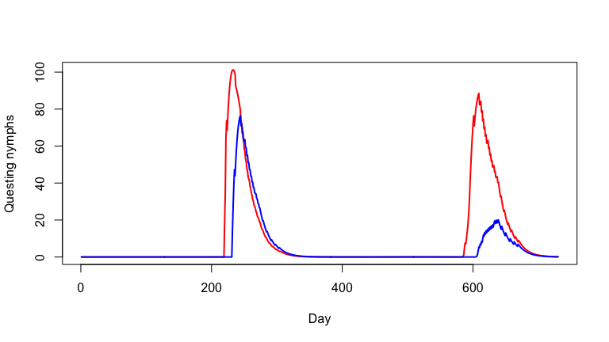

<!-- README.md is generated from README.Rmd. Please edit that file -->
<!-- badges: start -->

[](https://github.com/dallenmidd/IxPopDyMod/actions/workflows/R-CMD-check.yaml)
[](https://cran.r-project.org/package=IxPopDyMod)
[](https://app.codecov.io/gh/dallenmidd/IxPopDyMod?branch=master)
<!-- badges: end -->

# IxPopDyMod: A framework for Ixodidae Population Dynamics Models

This package is designed to help the user specify, run, and then
visualize and analyze the results of Ixodidae (hard-bodied ticks)
population dynamics models. Such models exist in the literature, but the
source code to run them is not always available. We wanted to provide an
easy way for these models to be written and shared.

<!-- TODO see paper for a full description of the model -->

## Installation

Install the package from
[CRAN](https://cran.r-project.org/package=IxPopDyMod) with:

``` r
install.packages("IxPopDyMod")
```

## Examples

Here we provide a series of examples to help others see how models are
specified and better understand the structure of the package. The
examples highlight:

1.  Basic package use with a simple model configuration
2.  How tick transitions can be temperature-dependent
3.  How to include the host community into a model
4.  How to include tick-borne disease infection dynamics into a model
5.  How to include host-host density dependent tick mortality

These examples all use and modify preset model configurations. If you
wish to create a custom model configuration, see `?config()`.

## Simple example

We start with `config_ex_1`, a simple model configuration that doesn’t
consider infection, and that has four life stages: `__e` for egg, `__l`
for larvae, `__n` for nymph, and `__a` for adult.

``` r
# library(IxPopDyMod)
devtools::load_all(export_all = FALSE)
```

### Vary a parameter in the model

We give a new range of parameter values for number of eggs laid.

``` r
eggs_laid <- c(800, 1000, 1200)

# need some way to vary parameter easily??
```

This gives us a list of three modified model `config`s, which differ
only in the number of eggs laid.

### Run the model with each new parameter value

``` r
outputs <- run_all_configs(modified_configs)
outputs[[1]]
```

The model output is a data frame where the column `day` indicates Julian
date, `stage` indicates tick life stage, and `pop` is population size.
The remaining columns breakdown the `stage` column into it’s constituent
parts: the `age` and current `process` of a tick, and whether it is
`infected`. Since we ran the model with multiple configurations, we get
a list of data frames. Here we inspect only the first.

### Calculate growth rate for each of the model outputs

``` r
sapply(outputs, growth_rate)
```

`growth_rate()` calculates the multiplicative growth rate for a model
output. The population is stable with 1000 eggs laid, as indicated by
the growth rate `1`. The population decreases with 800 eggs laid, and
increases with 1200 eggs laid.

### Graph outputs

To see a breakdown of how the population is changing, we graph the
population over time of each age group, for each model output. As
expected, for each output there is a cycle with a peak in number of
eggs, followed by peaks in larvae, nymph and then adult population.

``` r
names(outputs) <- c("0800 eggs laid", "1000 eggs laid", "1200 eggs laid")
outputs_stacked <- bind_rows(outputs, .id = "id")
outputs_stacked %>%
  graph_population_each_group() +
  facet_wrap(~id)
```

## Temperature-dependent transitions

``` r
temp_example_config$cycle
## need some way to show the life cycle
```

From the first line of this tick life-stage transitions table, you see
that the development from eggs, `__e`, to questing larvae, `q_l`, is an
exponential function of temperature. We can see the parameters for this
transition:

``` r
temp_example_config$parameters %>% filter(from == "__e", to == "q_l")
# this will need to be changed too
```

The daily development rate is `0.0000292*temp^2.27`.

### Compare two temperature scenarios

Here we highlight how this temperature dependence affects the output of
the model. We make a second `config` in which the daily temperature is
one degree warmer.

``` r

output <- run(temp_example_config)

temp_pred2 <- readr::read_csv("./data-raw/temp_example_config/predictors.csv")

temp_pred2$value <- temp_pred2$value + 1

temp_example_config2 <- temp_example_config
temp_example_config2$preds <- temp_pred2

output2 <- run(temp_example_config2)
```

Finally, we compare the outputs for a commonly measured aspect of tick
populations, the number of questing nymphs.

``` r
output_qn <- subset(output, stage == 'q_n')
output2_qn <- subset(output2, stage == 'q_n')

plot(output2_qn$day, output2_qn$pop, type = 'l', col = 'red', lwd = 2, xlab = 'Day', ylab='Questing nymphs')
lines(output_qn$day, output_qn$pop, type = 'l', col = 'blue', lwd = 2)
```



Here you can see nymphs start questing earlier and reach a higher
population in the warmer climate.

## Host community

In the previous example there was no host community explicitly stated
and ticks had a constant probability of transition between life stages
(e.g., from larva to nymph). It is possible to instead model these
probabilities based on host community composition.

``` r
host_example_config$cycle
## change here too
```

Here transition from questing larvae, `q_l`, to engorged larvae, `e_l`,
depends on the `host_den`, which is how the host community is included
in the transition.

``` r

host_example_config$parameters %>% filter(from == "q.l", to == "e.l")
```

Here the parameters of `find_n_feed` get different values for each host
species. In this case the two parameters are `pref`, which is the larval
tick’s preference for the three different host species, and
`feed_success`, which is the fraction of feeding larvae which
successfully feed to completion.

In this example the temperature and host community are constant through
time, but the package also supports variable temperature and host
community data to see how seasonal or year-to-year variation in affects
tick populations.

### Compare host communities of different densities

We now compare how different host densities affect tick populations.
Here we vary the deer density.

``` r
cfg_lowdeer <- host_example_config
cfg_highdeer <- host_example_config

cfg_lowdeer$preds$value[cfg_lowdeer$preds$pred_subcategory == 'deer'] <- 0.1
cfg_highdeer$preds$value[cfg_highdeer$preds$pred_subcategory == 'deer'] <- 5

output_lowdeer <- run(cfg_lowdeer)
output_middeer <- run(host_example_config)
output_highdeer <- run(cfg_highdeer)

output_lowdeer_qn <- subset(output_lowdeer, stage == 'q_n')
output_middeer_qn <- subset(output_middeer, stage == 'q_n')
output_highdeer_qn <- subset(output_highdeer, stage == 'q_n')


plot(output_highdeer_qn$day, log10(output_highdeer_qn$pop), type = 'l', lwd = 2, col = '#1b9e77', yaxt = 'n', ylab ='Questing nymphs', xlab = 'Day', ylim = c(2,5))
lines(output_middeer_qn$day, log10(output_middeer_qn$pop), col = '#d95f02', lwd = 2)
lines(output_lowdeer_qn$day, log10(output_lowdeer_qn$pop), col = '#7570b3', lwd = 2)
text(x = 25, y = c(4.25,4,3.75), labels = c('High deer den.', 'Mid deer den.', 'Low deer den.'), col = c('#1b9e77', '#d95f02', '#7570b3'))
axis(side = 2, at = 2:5, labels = c(expression(10^2),expression(10^3),expression(10^4),expression(10^5)))
```


## Tick-borne disease infection dynamics

In the examples above we modeled a tick population without a tick borne
disease. Here we give an example of how the package can be used to also
include infection dynamics.

So far all examples have used transition functions loaded into the
package, here we show how to define our own.

``` r
find_host <- function(x, y, a, pref) {
  1 - (1 - a)^sum(x * pref)
}
```

``` r
infect_example_config$cycle
```

Here we use the middle character of the life-stage key. It is either `i`
for infected or `u` for uninfected. We assume no transovarial infection
so questing larvae are uninfected. But after they feed, `f_l`, they can
either become engorged infected, `eil`, or engorged uninfected, `eul`,
larvae. This is based on `infect_fun`, which as above has host
species-specific parameters of `pref` and `host_rc` (reservoir
competence).

### Effect of deer density

Deer are important to the blacklegged tick as the main host of adult
ticks. As such they are thought to increase tick populations (see
above). But deer can also serve as hosts for juvenile tick life stages,
and deer are poor reservoirs for *Borrelia burgdorferi*. So increased
deer density may also decrease the proportion of bloodmeals juvenile
ticks take from more competent reservoirs life mice. We use this simple
model to illustrate this possibility.

``` r
deer_den <- c(0.1, 0.25, 0.5, 0.75, 1)
results_df <- data.frame(deer = deer_den, nymph_den = 0, nip = 0)

for (i in 1:5)
{
  cfg_mod <- infect_example_config
  cfg_mod$preds[1, 4] <- deer_den[i]
  out <- run(cfg_mod)


  results_df$nip[i] <- sum(out[out$stage=='qin','pop'])/(sum(out[out$stage=='qin','pop']) + sum(out[out$stage=='qun','pop']))

  results_df$nymph_den[i] <- sum(out[out$stage=='qin','pop']) + sum(out[out$stage=='qun','pop'])
}

plot(results_df$deer,results_df$nymph_den, xlab = 'Deer density', ylab = 'Number of questing nymphs')
```


``` r

plot(results_df$deer,results_df$nip, xlab = 'Deer density', ylab = 'Nymph infection rate')
```


Here we see that as deer density increases the number of nymphs
increases, but the nymph infection prevalence (NIP) goes down.
