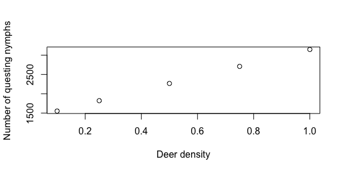

<!-- README.md is generated from README.Rmd. Please edit that file -->

# IxPopDyMod: A framework for Ixodidae Population Dynamics Models

This package is designed to help the user specify, run, and then
visualize and analyze the results of Ixodidae (hard-bodied ticks)
population dynamics models. Such population dynamics models exist in the
literature, but the source code to run them is not always available. We
wanted to provide an easy way for these models to be written and shared.

TODO see paper for a full description of the model

## Installation

Install the package from
[CRAN](https://cran.r-project.org/web/packages/IxPopDyMod/index.html)
with:

``` r
install.packages("IxPopDyMod")
```

## Examples

Here we provide a series of examples to help others see how models are
specified and better understand the structure of the package. The
examples highlight:

1.  A very simple example to show basic package commands
2.  How tick transitions can be temperature-dependent
3.  How to include the host community into a model
4.  How to include tick-borne disease infection dynamics into a model
5.  How to include host-host density dependent tick mortality

## Simple example

We present an example analysis using a simple model configuration
pre-loaded into the package. In this example, we will:

1.  Vary a parameter in the model
2.  Run the model with each new parameter value
3.  Calculate the growth rate for each of the model outputs
4.  Graph the population over time for each out of the outputs

If you wish to create a custom model configuration, see `?config()`.

``` r
library(IxPopDyMod)
library(ggplot2)
library(dplyr, warn.conflicts = FALSE)
```

### Vary a parameter in the model

We start with `config_ex_1`, a simple model configuration that doesn’t
consider infection, and that has four life stages: `__e` for egg, `__l`
for larvae, `__n` for nymph, and `__a` for adult. We give a new range of
parameter values for number of eggs laid.

``` r
eggs_laid <- c(800, 1000, 1200)
modified_configs <- vary_param(config_ex_1, from = '__a', to = '__e', 
                               param_name = 'a', values = eggs_laid)
```

This gives us a list of three modified model `config`s, which differ
only in the number of eggs laid.

### Run the model with each new parameter value

``` r
outputs <- run_all_configs(modified_configs)
outputs[[1]]
#> # A tibble: 116 × 6
#>      day stage    pop age_group process infected
#>    <int> <chr>  <dbl> <chr>     <chr>   <lgl>   
#>  1     1 __e        0 e         _       FALSE   
#>  2     1 __l        0 l         _       FALSE   
#>  3     1 __n        0 n         _       FALSE   
#>  4     1 __a     1000 a         _       FALSE   
#>  5     2 __e   800000 e         _       FALSE   
#>  6     2 __l        0 l         _       FALSE   
#>  7     2 __n        0 n         _       FALSE   
#>  8     2 __a        0 a         _       FALSE   
#>  9     3 __e        0 e         _       FALSE   
#> 10     3 __l   800000 l         _       FALSE   
#> # … with 106 more rows
```

The model output is a data frame where the column `day` indicates Julian
date, `stage` indicates tick life stage, and `pop` is population size.
The remaining columns breakdown the `stage` column into it’s constituent
parts: the `age` and current `process` of a tick, and whether it is
`infected`. Since we ran the model with multiple configurations, we get
a list of data frames. Here we inspect only the first.

### Calculate growth rate for each of the model outputs

``` r
sapply(outputs, growth_rate) 
#> [1] 0.9457416 1.0000000 1.0466351
```

`growth_rate` calculates the multiplicative growth rate for a model
output. The population is stable with 1000 eggs laid, as indicated by
the growth rate `1`. The population decreases with 800 eggs laid, and
increases with 1200 eggs laid.

### Graph outputs

To see a breakdown of how the population is changing, we graph the
population over time of each age group, for each model output. As
expected, for each output there is a cycle with a peak in number of
eggs, followed by peaks in larvae, nymph and then adult population.

``` r
names(outputs) <- c('0800 eggs laid', '1000 eggs laid', '1200 eggs laid')
outputs_stacked <- bind_rows(outputs, .id = "id")
outputs_stacked %>%
  graph_population_each_group() +
  facet_wrap(~ id)
```


## Temperature-dependent transitions

In this second example we load in an external `config`. The first step
is always to read a `config` file. This is the configuration which
specifies the model. Here I read the `config` and then show the tick
life-stage transitions.

``` r
cfg <- read_config('vignettes/temp_example_config/config.yml')
cfg$transitions
#> # A tibble: 16 × 7
#>    from  to    transition_fun delay source            pred1 pred2
#>    <chr> <chr> <chr>          <lgl> <chr>             <chr> <lgl>
#>  1 __e   q_l   expo_fun       TRUE  Ogden et al. 2004 temp  NA   
#>  2 __e   m     constant_fun   TRUE  Ogden et al. 2005 <NA>  NA   
#>  3 q_l   m     constant_fun   FALSE Ogden et al. 2005 <NA>  NA   
#>  4 q_n   m     constant_fun   FALSE Ogden et al. 2005 <NA>  NA   
#>  5 q_a   m     constant_fun   FALSE Ogden et al. 2005 <NA>  NA   
#>  6 e_l   m     constant_fun   TRUE  Ogden et al. 2005 <NA>  NA   
#>  7 e_n   m     constant_fun   TRUE  Ogden et al. 2005 <NA>  NA   
#>  8 e_a   m     constant_fun   TRUE  Ogden et al. 2005 <NA>  NA   
#>  9 r_a   m     constant_fun   FALSE Ogden et al. 2005 <NA>  NA   
#> 10 q_l   e_l   constant_fun   FALSE <NA>              <NA>  NA   
#> 11 e_l   q_n   expo_fun       TRUE  <NA>              temp  NA   
#> 12 q_n   e_n   constant_fun   FALSE <NA>              <NA>  NA   
#> 13 e_n   q_a   expo_fun       TRUE  <NA>              temp  NA   
#> 14 q_a   e_a   constant_fun   FALSE <NA>              <NA>  NA   
#> 15 e_a   r_a   expo_fun       TRUE  <NA>              temp  NA   
#> 16 r_a   __e   constant_fun   FALSE <NA>              <NA>  NA
```

From the first line, you see that the development from eggs, `__e`, to
questing larvae, `q_l`, is an exponential function of temperature. We
can see the parameters for this transition:

``` r
cfg$parameters %>% filter(from == '__e', to == 'q_l')
#> # A tibble: 2 × 8
#>   from  to    param_name host_spp param_value param_ci_low param_ci_high source 
#>   <chr> <chr> <chr>      <lgl>          <dbl> <lgl>        <lgl>         <chr>  
#> 1 __e   q_l   a          NA         0.0000292 NA           NA            Ogden …
#> 2 __e   q_l   b          NA         2.27      NA           NA            Ogden …
```

The daily development rate is \(0.0000292*temp^{2.27}\).

### Compare two temperature scenarios

Here I highlight how this temperature dependence affects the output of
the model. I make a second `config` in which the daily temperature is
one degree warmer.

``` r

cfg2 <- cfg
cfg2$weather <- cfg$weather %>% mutate(tmean = tmean + 1)

output1 <- run(cfg)
output2 <- run(cfg2)

output1 <- output1 %>% mutate(temp = 'cold')
output2 <- output2 %>% mutate(temp = 'warm')
```

Finally I compare the outputs for a commonly measured aspect of tick
populations, the number of questing nymphs.

``` r
output1 %>%
  rbind(output2) %>% 
  filter(stage == 'q_n') %>%
  ggplot(aes(day, pop, col = temp)) +
  geom_line() +
  scale_color_manual(values = c('cold' = 'blue', 'warm' = 'red')) +
  ylab('Questing nymphs')
```


Here you can see nymphs start questing earlier and reach a higher
population in the warmer climate.

## Host community

In the previous example there was no host community explicitly stated
and ticks had a constant probabilty of transition between life stages
(e.g., from larva to nymph). It is possible to instead model these
probabilities based on host community composition.

``` r
cfg <- read_config('vignettes/host_example_config/config.yml')
cfg$transitions
#> # A tibble: 16 × 7
#>    from  to    transition_fun delay source            pred1    pred2
#>    <chr> <chr> <chr>          <lgl> <chr>             <chr>    <lgl>
#>  1 __e   q_l   expo_fun       TRUE  Ogden et al. 2004 temp     NA   
#>  2 __e   m     constant_fun   TRUE  Ogden et al. 2005 <NA>     NA   
#>  3 q_l   m     constant_fun   FALSE Ogden et al. 2005 <NA>     NA   
#>  4 q_n   m     constant_fun   FALSE Ogden et al. 2005 <NA>     NA   
#>  5 q_a   m     constant_fun   FALSE Ogden et al. 2005 <NA>     NA   
#>  6 e_l   m     constant_fun   TRUE  Ogden et al. 2005 <NA>     NA   
#>  7 e_n   m     constant_fun   TRUE  Ogden et al. 2005 <NA>     NA   
#>  8 e_a   m     constant_fun   TRUE  Ogden et al. 2005 <NA>     NA   
#>  9 r_a   m     constant_fun   FALSE Ogden et al. 2005 <NA>     NA   
#> 10 q_l   e_l   find_n_feed    FALSE <NA>              host_den NA   
#> 11 e_l   q_n   expo_fun       TRUE  <NA>              temp     NA   
#> 12 q_n   e_n   find_n_feed    FALSE <NA>              host_den NA   
#> 13 e_n   q_a   expo_fun       TRUE  <NA>              temp     NA   
#> 14 q_a   e_a   find_n_feed    FALSE <NA>              host_den NA   
#> 15 e_a   r_a   expo_fun       TRUE  <NA>              temp     NA   
#> 16 r_a   __e   constant_fun   FALSE <NA>              <NA>     NA
```

Here transition from questing larvae, `q_l`, to engroged larvae, `e_l`,
depends on the `host_den`, this is how the host community is included in
the transition.

``` r
cfg$parameters %>% filter(from == 'q.l', to == 'e.l')
#> # A tibble: 6 × 8
#>   from  to    param_name  host_spp param_value param_ci_low param_ci_high source
#>   <chr> <chr> <chr>       <chr>          <dbl> <lgl>        <lgl>         <chr> 
#> 1 q.l   e.l   pref        deer            0.25 NA           NA            <NA>  
#> 2 q.l   e.l   feed_succe… deer            0.49 NA           NA            Levi …
#> 3 q.l   e.l   pref        mouse           1    NA           NA            <NA>  
#> 4 q.l   e.l   feed_succe… mouse           0.49 NA           NA            Levi …
#> 5 q.l   e.l   pref        squirrel        0.25 NA           NA            <NA>  
#> 6 q.l   e.l   feed_succe… squirrel        0.17 NA           NA            Levi …
```

Here the parameters of `find_n_feed` get different values for each host
species. In this case the two parameters are `pref`, which is the larval
tick’s preference for the three different host species, and
`feed_success`, which is the fraction of feeding larvae which
successfully feed to completion.

In this example the temperature and host community are constant through
time, but this case change to see how seasonal or year-to-year variation
in host density affects tick populations.

### Compare host communities of different densities

I now compare how different host densities affect tick populations. Here
I vary the deer density.

``` r
cfg_lowdeerden <- cfg
cfg_highdeerden <- cfg
cfg_lowdeerden$host_comm <- cfg$host_comm %>% 
  mutate(host_den = ifelse(host_spp == 'deer', 0.1, host_den) )

cfg_highdeerden$host_comm <- cfg$host_comm %>% 
  mutate(host_den = ifelse(host_spp == 'deer', 5, host_den) )


output_middeerden <- run(cfg)
output_lowdeerden <- run(cfg_lowdeerden)
output_highdeerden <- run(cfg_highdeerden)

output_middeerden <- output_middeerden %>% mutate(deer_den = 'mid')
output_lowdeerden <- output_lowdeerden %>% mutate(deer_den = 'low')
output_highdeerden <- output_highdeerden %>% mutate(deer_den = 'high')
```

And then use the `graph_population_each_group` function to see how the
deer densities affect the tick population.

``` r
output_lowdeerden %>%
  bind_rows(output_middeerden, output_highdeerden) %>%
  mutate(deer_den = factor(deer_den, levels = c('low', 'mid', 'high'))) %>%
  graph_population_each_group() +
  facet_wrap(~deer_den)
```



## Tick-borne disease infection dynamics

In the examples above I modeled just a tick population without a tick
borne disease. Here I give an example of how the package can be used to
also include

So far all examples use transition functions loaded into the package,
here we show how to define our own.

``` r
find_host <- function(x, y, a, pref)
{
  1-(1-a)^sum(x*pref)
}
```

``` r
cfg <- read_config('vignettes/infect_example_config/config.yml')
cfg$transitions
#> # A tibble: 33 × 6
#>    from  to    transition_fun delay pred1    pred2
#>    <chr> <chr> <chr>          <lgl> <chr>    <lgl>
#>  1 __e   q_l   constant_fun   TRUE  <NA>     NA   
#>  2 __e   m     constant_fun   TRUE  <NA>     NA   
#>  3 q_l   f_l   find_host      FALSE host_den NA   
#>  4 q_l   m     constant_fun   FALSE <NA>     NA   
#>  5 f_l   eil   infect_fun     FALSE host_den NA   
#>  6 f_l   eul   infect_fun     FALSE host_den NA   
#>  7 eil   qin   constant_fun   TRUE  <NA>     NA   
#>  8 eil   m     constant_fun   TRUE  <NA>     NA   
#>  9 eul   qun   constant_fun   TRUE  <NA>     NA   
#> 10 eul   m     constant_fun   TRUE  <NA>     NA   
#> # … with 23 more rows
```

Here we use the middle character of the life-stage key. It is either `i`
for infected or `u` for uninfected. We assume no transovarial infection
so questing larvae are uninfected. But after they feed, `f_l`, they can
either become engorged infected, `eil`, or engorged uninfected, `eul`,
larvae. This is based on `infect_fun`, which as above has host
species-specific parameters of `pref` and `host_rc` (reservoir
competence).

### Effect of deer density

Deer are important to the blacklegged tick as the main host of adult
ticks. As such they are thought to increase tick populations (see
above). But deer can also serve as hosts for juvenile tick life stages,
and deer are poor reservoirs for *Borrelia burgdorferi*. So increased
deer density may also decrease the proportion of bloodmeals juvenile
ticks take from more comptenet reservoirs life mice. We use this simple
model to illustrate this possiblity.

``` r
deer_den <- c(0.1, 0.25, 0.5, 0.75, 1)
results_tib <- tibble(deer = deer_den, nymph_den = 0, nip = 0)

for (i in 1:5)
{
  cfg_mod <- cfg
  cfg_mod$host_comm[1,2] <- deer_den[i]
  out <- run(cfg_mod)
  
  nymph_sum <- out %>%
  filter(stage == 'qin' | stage == 'qun') %>%
  group_by(stage) %>%
  summarise(totpop = sum(pop)) 

  results_tib$nip[i] <- unlist(nymph_sum[1,2] /(nymph_sum[1,2] + nymph_sum[2,2]))
  results_tib$nymph_den[i] <- out %>%
    filter(stage == 'qin' | stage == 'qun') %>%
    summarise(totpop = sum(pop)) %>%
    unlist()
}
#> [1] "day 100"
#> [1] "day 200"
#> [1] "day 300"
#> [1] "day 400"
#> [1] "day 100"
#> [1] "day 200"
#> [1] "day 300"
#> [1] "day 400"
#> [1] "day 100"
#> [1] "day 200"
#> [1] "day 300"
#> [1] "day 400"
#> [1] "day 100"
#> [1] "day 200"
#> [1] "day 300"
#> [1] "day 400"
#> [1] "day 100"
#> [1] "day 200"
#> [1] "day 300"
#> [1] "day 400"

results_tib %>%
  ggplot(aes(deer, nip)) +
  geom_point()
```


``` r

results_tib %>%
  ggplot(aes(deer, nymph_den)) +
  geom_point()
```


Here we see that as deer density increases the number of nymphs
increases (as the tick population gets bigger). But the nymph infection
prevalence (NIP) goes down.
