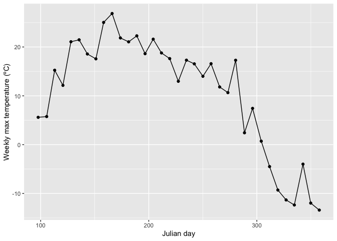
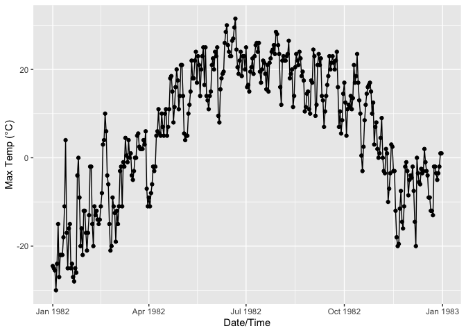
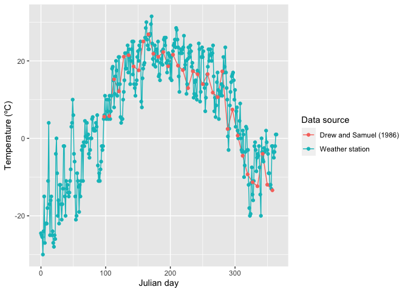
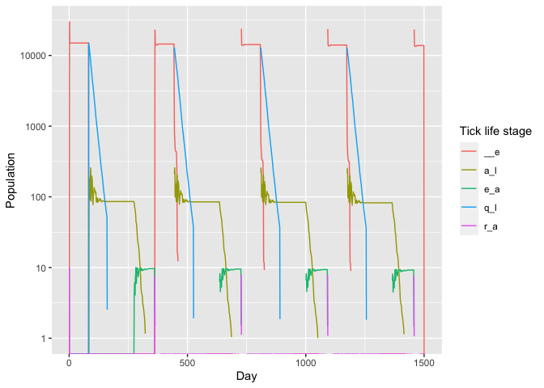
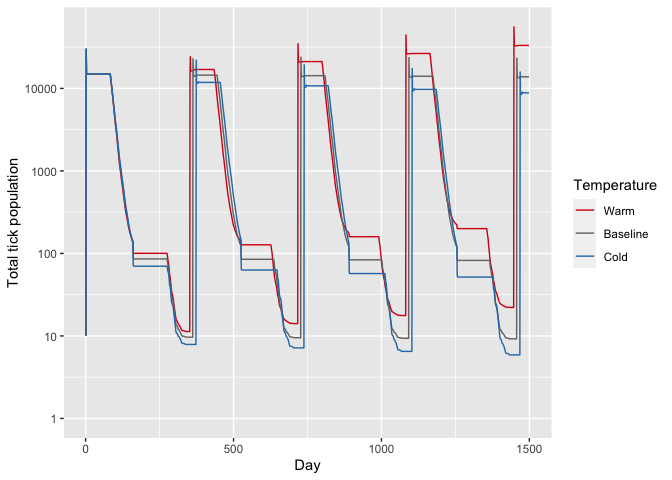

A winter tick population model
================

## Summary

In this vignette, we’ll demonstrate how we used `IxPopDyMod` to
reproduce the winter tick population dynamics that Drew and Samuel
(1986) observed in the field in Alberta, Canada.

## Assembling predictor data to use in model

### Data from Drew and Samuel (1986)

First, we’ll gather historical weather data from time period of the Drew
and Samuel (1986) study. One of their field sites was a grassland
habitat in Elk Island National Park, where they observed these weekly
max temperatures (digitized from Figure 5):

``` r
library(dplyr)
library(readr)
library(ggplot2)

weekly_max_temp <- read_csv("drew_samuel_1986_fig5_grassland_digitized.csv")

weekly_max_temp_plot <- weekly_max_temp %>%
  ggplot(aes(x = j_day, y = temp)) +
  geom_point() +
  geom_line() +
  xlab("Julian day") +
  ylab("Weekly max temperature (ºC)")

weekly_max_temp_plot
```

<!-- -->

### Data from weather station

While Drew and Samuel present weekly maximum temperatures, `IxPopDyMod`
expects weather data with daily resolution. Fortunately, a weather
station at Elk Island has the data we need. The data is accessible via
the Canadian Government’s historical climate data portal, at this
[download
link](https://climate.weather.gc.ca/climate_data/daily_data_e.html?hlyRange=1994-02-01%7C2022-01-12&dlyRange=1981-11-01%7C2022-01-12&mlyRange=1981-01-01%7C2007-11-01&StationID=1873&Prov=AB&urlExtension=_e.html&searchType=stnName&optLimit=yearRange&StartYear=1840&EndYear=2022&selRowPerPage=25&Line=0&searchMethod=contains&Month=1&Day=12&txtStationName=elk+island&timeframe=2&Year=1982).
Here we plot that data.

``` r
daily_weather <- read_csv("en_climate_daily_AB_3012275_1982_P1D.csv")
daily_weather_plot <- daily_weather %>%
  ggplot(aes(
    x = `Date/Time`,
    y = `Max Temp (°C)`
  )) +
  geom_point() +
  geom_line()

daily_weather_plot
```

<!-- -->

We can plot the two data sources together to visually confirm that they
are similar.

``` r
comparison <- daily_weather %>%
  mutate(
    j_day = as.POSIXlt(`Date/Time`)$yday,
    data_source = "Weather station"
  ) %>%
  select(j_day, data_source, temp = `Max Temp (°C)`) %>%
  bind_rows(weekly_max_temp %>% mutate(data_source = "Drew and Samuel (1986)"))

comparison %>%
  ggplot(aes(x = j_day, y = temp, color = data_source)) +
  geom_line() +
  geom_point() +
  xlab("Julian day") +
  ylab("Temperature (ºC)") +
  labs(color = "Data source")
```

<!-- -->

Now that we observe that the data is similar, we can use the weather
station data to try to reproduce the field study’s results with our
model.

### Reshaping the data

We must reshape the weather data into a `IxPopDyMod::predictors()`
object to use it in the model. For details on the required structure,
see the `IxPopDyMod::predictors()` documentation. In addition to
temperature, we’ll also include snow cover in the predictors data, as
this has been observed to affect the winter tick life cycle, notably the
survival of questing larvae.

``` r
library(tidyr)
predictors <- daily_weather %>%
  mutate(j_day = 1:365) %>%
  rename(max_temp = `Max Temp (°C)`, snow_cover = `Snow on Grnd (cm)`) %>%
  pivot_longer(
    cols = c(max_temp, snow_cover),
    values_to = "value", names_to = "pred"
  ) %>%
  mutate(
    pred_subcategory = NA,
    value = ifelse(is.na(value), 0, value)
  ) %>%
  select(pred, pred_subcategory, j_day, value)
```

In order to allow modelling the winter tick population over multiple
years, we’ll repeat the weather data several times.

``` r
accumulate <- predictors
for (i in 1:10) {
  accumulate <- bind_rows(accumulate, predictors)
}
days <- seq_len(nrow(accumulate) / 2)
days <- c(days, days) %>% sort()
accumulate$j_day <- days
```

``` r
offset <- 155
accumulate <- accumulate %>%
  mutate(true_j_day = j_day) %>%
  filter(true_j_day > offset) %>%
  mutate(j_day = j_day - offset)
```

Finally, we add host density data to the predictors table. The only host
we’re concerned with in this case is moose. The `j_day` is set as `NA`
to indicate that this is a constant predictor, i.e. it does not change
over time.

``` r
# add a row for host density
accumulate <- bind_rows(
  data.frame(pred="host_den", pred_subcategory="moose", j_day=NA, value=0.18),
  accumulate
)
head(accumulate)
```

    ##         pred pred_subcategory j_day value true_j_day
    ## 1   host_den            moose    NA  0.18         NA
    ## 2   max_temp             <NA>     1  9.50        156
    ## 3 snow_cover             <NA>     1  0.00        156
    ## 4   max_temp             <NA>     2  8.00        157
    ## 5 snow_cover             <NA>     2  0.00        157
    ## 6   max_temp             <NA>     3 15.50        158

## Configuring the model

The first step in modeling a tick population using `IxPopDyMod` is
creating a `config` object. This will represent all the components of a
tick life cycle, as well as the input predictor data that can determine
that rates and durations of transitions between tick life stages.

We created this configuration by drawing from literature on
relationships between climate and host communities and winter tick
development (TODO: cite specific studies). For parameters not well
described/understood in the literature, we used the model to deduce
reasonable parameter values. The configuration is as follows:

``` r
devtools::load_all()

winter_tick <- config(
  life_cycle(
    transition("__e", "q_l", constant_fun, "duration", parameters = list(a = 0.0125)),
    transition(
      "__e",
      NULL,
      constant_fun,
      "duration",
      mortality_type = 'throughout_transition',
      parameters = list(a = 0.5)
    ),
    transition(
      "q_l",
      "a_l",
      feed_fun,
      "probability",
      predictors = list(x = predictor_spec('host_den'), y = predictor_spec('max_temp')),
      parameters = list(
        a = 0.1,
        pref = 1,
        q = 7e-4,
        tmax = 35,
        tmin = 0
      )
    ),
    transition(
      'q_l',
      NULL,
      snow_cover_fun,
      "probability",
      mortality_type = 'per_day',
      predictors = list(x = predictor_spec('snow_cover')),
      parameters = c(no_snow_mort = 0.06, snow_mort = 0.95)
    ),
    transition('a_l', 'e_a', constant_fun, 'duration', parameters = list(a = 0.00526)),
    transition(
      'a_l',
      NULL,
      constant_fun,
      'duration',
      mortality_type = 'throughout_transition',
      parameters = list(a = 0.97)
    ),
    transition(
      'e_a',
      'r_a',
      expo_fun,
      'duration',
      predictors = list(x = predictor_spec('max_temp', first_day_only = FALSE)),
      parameters = list(a = 0.0002, b = 1.67)
    ),
    transition(
      'e_a',
      NULL,
      snow_cover_fun,
      'duration',
      predictors = list(x = predictor_spec('snow_cover')),
      mortality_type = 'throughout_transition',
      parameters = c(no_snow_mort = 0.36, snow_mort = 0.89)
    ),
    transition('r_a', '__e', constant_fun, 'probability', parameters = c(a = 3000))
  ),
  initial_population = c(r_a = 10),
  steps = 1000,
  preds = accumulate
)
```

## Run the model

Now that we have a `config` built, running the model is simple! Observe:

``` r
model_results <- run(winter_tick, progress = FALSE)
head(model_results)
```

    ##   day stage   pop
    ## 1   1   __e     0
    ## 2   1   q_l     0
    ## 3   1   a_l     0
    ## 4   1   e_a     0
    ## 5   1   r_a    10
    ## 6   2   __e 30000

For a quick assessment of population dynamics, we can calculate the
growth rate.

``` r
growth_rate(model_results)
```

    ## [1] 1.00213

Since the growth rate is close to `1` the population is roughly stable.
It’s more revealing to plot the population over time, split up by life
stage. We’ll write a simple function to do so.

``` r
plot_population <- function(model_output) {
  ggplot(model_output, aes(x = day, y = pop, color = stage)) +
    geom_line() +
    scale_y_log10(limits = c(1, NA))
}

plot_population(model_results) +
  xlab("Day") +
  ylab("Population") +
  labs(col = "Tick life stage")
```

<!-- -->

### Modifying moose density

Now that we have a fairly stable model output, we can modify it, for
example to see the impacts of different host community or climate
dynamics on the tick population.

First, let’s try increasing the density of moose. We can find the
current moose density, which we put in the first row of the predictors
data:

``` r
winter_tick$preds[1, ]
```

    ##       pred pred_subcategory j_day value true_j_day
    ## 1 host_den            moose    NA  0.18         NA

We’ll re-run the model with a range of moose densities.

``` r
densities <- 0.18 * c(0.1, 0.5, 1, 2, 10)

configs <- lapply(
  densities,
  function(value) {
    cfg <- winter_tick
    cfg$preds[1, "value"] <- value
    return(cfg)
  }
)

results <- lapply(configs, run, progress = FALSE)
```

To compare the results, we’ll plot the total tick population over time
for each parameterization.

``` r
# We add a column to each dataframe to identify what parameterization it was
# created with
for (i in seq_along(results)) {
  results[[i]]$density <- as.factor(densities[[i]])
}

# Then we combine all the results, to facilitate plotting them together
all_results <- bind_rows(results)

all_results %>%
  group_by(density, day) %>%
  summarize(total_population = sum(pop), .groups = "drop") %>%
  ggplot(aes(x = day, y = total_population, col = density)) +
  geom_line() +
  scale_y_log10(limits = c(1, NA)) +
  labs(col = "Moose per km^2") +
  xlab("Day") +
  ylab("Total tick population")
```

<!-- -->

As expected, modeled tick populations grow with higher moose density. We
can confirm this by calculating the growth rate under each scenario:

``` r
growth_rates <- lapply(results, growth_rate)
names(growth_rates) <- paste("Growth rate with moose density =", densities)
growth_rates
```

    ## $`Growth rate with moose density = 0.018`
    ## [1] 0.995826
    ## 
    ## $`Growth rate with moose density = 0.09`
    ## [1] 1.000371
    ## 
    ## $`Growth rate with moose density = 0.18`
    ## [1] 1.00213
    ## 
    ## $`Growth rate with moose density = 0.36`
    ## [1] 1.003649
    ## 
    ## $`Growth rate with moose density = 1.8`
    ## [1] 1.005893

### Modifying climate

Here, we try running the model under three distinct climate scenarios.

``` r
winter_tick_warm <- winter_tick
winter_tick_warm$preds <-
  winter_tick_warm$preds %>%
  mutate(value = ifelse(pred == "max_temp", value + 2.5, value))
warm_run <- run(winter_tick_warm, progress = FALSE)

winter_tick_cold <- winter_tick
winter_tick_cold$preds <-
  winter_tick_cold$preds %>%
  mutate(value = ifelse(pred == "max_temp", value - 2.5, value))
cold_run <- run(winter_tick_cold, progress = FALSE)

cold_run$temp <- "Cold"
warm_run$temp <- "Warm"
model_results$temp <- "Baseline"

all_temp_results <- bind_rows(cold_run, warm_run, model_results)
all_temp_results %>%
  group_by(temp, day) %>%
  summarize(pop = sum(pop), .groups = "drop") %>%
  ggplot(aes(x = day, y = pop, col = factor(temp, levels = c("Warm", "Baseline", "Cold")))) +
  geom_line() +
  scale_y_log10(limits = c(1, NA)) +
  scale_color_manual(values = c(Cold = "#2c7bb6", Warm = "#d7191c", Baseline = "#757473")) +
  xlab("Day") +
  ylab("Total tick population") +
  labs(col = "Temperature")
```

<!-- -->

We can observe that the phenology and populations are both affected.
Eggs are laid (the only times that the population increases) earlier in
the year under the warm climate scenario. Additionally, total population
is larger under the warmer climate scenarios.
