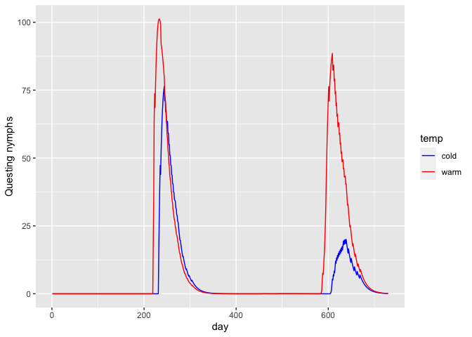

Temperature-dependent transitions
================

## The `config` file

In this simple vignette, I give an example where some of the life-stage
transitions are temperature dependent. Here I load the `config` and show
the transitions

``` r
cfg <- read_config('config_local.yml')
cfg$transitions
```

    ## # A tibble: 16 × 7
    ##    from  to    transition_fun delay source            pred1 pred2
    ##    <chr> <chr> <chr>          <lgl> <chr>             <chr> <lgl>
    ##  1 __e   q_l   expo_fun       TRUE  Ogden et al. 2004 temp  NA   
    ##  2 __e   m     constant_fun   TRUE  Ogden et al. 2005 <NA>  NA   
    ##  3 q_l   m     constant_fun   FALSE Ogden et al. 2005 <NA>  NA   
    ##  4 q_n   m     constant_fun   FALSE Ogden et al. 2005 <NA>  NA   
    ##  5 q_a   m     constant_fun   FALSE Ogden et al. 2005 <NA>  NA   
    ##  6 e_l   m     constant_fun   TRUE  Ogden et al. 2005 <NA>  NA   
    ##  7 e_n   m     constant_fun   TRUE  Ogden et al. 2005 <NA>  NA   
    ##  8 e_a   m     constant_fun   TRUE  Ogden et al. 2005 <NA>  NA   
    ##  9 r_a   m     constant_fun   FALSE Ogden et al. 2005 <NA>  NA   
    ## 10 q_l   e_l   constant_fun   FALSE <NA>              <NA>  NA   
    ## 11 e_l   q_n   expo_fun       TRUE  <NA>              temp  NA   
    ## 12 q_n   e_n   constant_fun   FALSE <NA>              <NA>  NA   
    ## 13 e_n   q_a   expo_fun       TRUE  <NA>              temp  NA   
    ## 14 q_a   e_a   constant_fun   FALSE <NA>              <NA>  NA   
    ## 15 e_a   r_a   expo_fun       TRUE  <NA>              temp  NA   
    ## 16 r_a   __e   constant_fun   FALSE <NA>              <NA>  NA

From the first line, you see that the development from eggs, `__e`, to
questing larvae, `q_l`, is an exponential function of temperature. We
can see the parameters for this transition:

``` r
cfg$parameters %>% filter(from == '__e', to == 'q_l')
```

    ## # A tibble: 2 × 8
    ##   from  to    param_name host_spp param_value param_ci_low param_ci_high source 
    ##   <chr> <chr> <chr>      <lgl>          <dbl> <lgl>        <lgl>         <chr>  
    ## 1 __e   q_l   a          NA         0.0000292 NA           NA            Ogden …
    ## 2 __e   q_l   b          NA         2.27      NA           NA            Ogden …

The daily development rate is 0.0000292\*temp^2.27.

## Compare two temperature scenarios

Here I highlight how this temperature dependence affects the output of
the model. I make a second `config` in which the daily temperature is
one degree warmer.

``` r
cfg2 <- cfg
cfg2$weather <- cfg$weather %>% mutate(tmean = tmean + 1)

output1 <- run(cfg)
```

    ## [1] "day 100"
    ## [1] "day 200"
    ## [1] "day 300"
    ## [1] "day 400"
    ## [1] "day 500"
    ## [1] "day 600"
    ## [1] "day 700"

``` r
output2 <- run(cfg2)
```

    ## [1] "day 100"
    ## [1] "day 200"
    ## [1] "day 300"
    ## [1] "day 400"
    ## [1] "day 500"
    ## [1] "day 600"
    ## [1] "day 700"

``` r
output1 <- output1 %>% mutate(temp = 'cold')
output2 <- output2 %>% mutate(temp = 'warm')
```

Finally I compare the outputs for a commonly measured aspect of tick
populations, the number of questing nymphs.

``` r
output1 %>%
  rbind(output2) %>% 
  filter(stage == 'q_n') %>%
  ggplot(aes(day, pop, col = temp)) +
  geom_line() +
  scale_color_manual(values = c('cold' = 'blue', 'warm' = 'red')) +
  ylab('Questing nymphs')
```

<!-- -->

Here you can see nymphs start questing earlier and reach a higher
population in the warmer climate.
